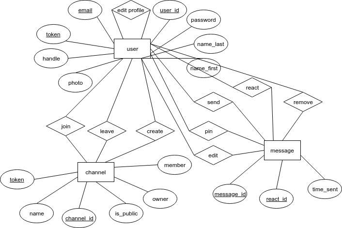
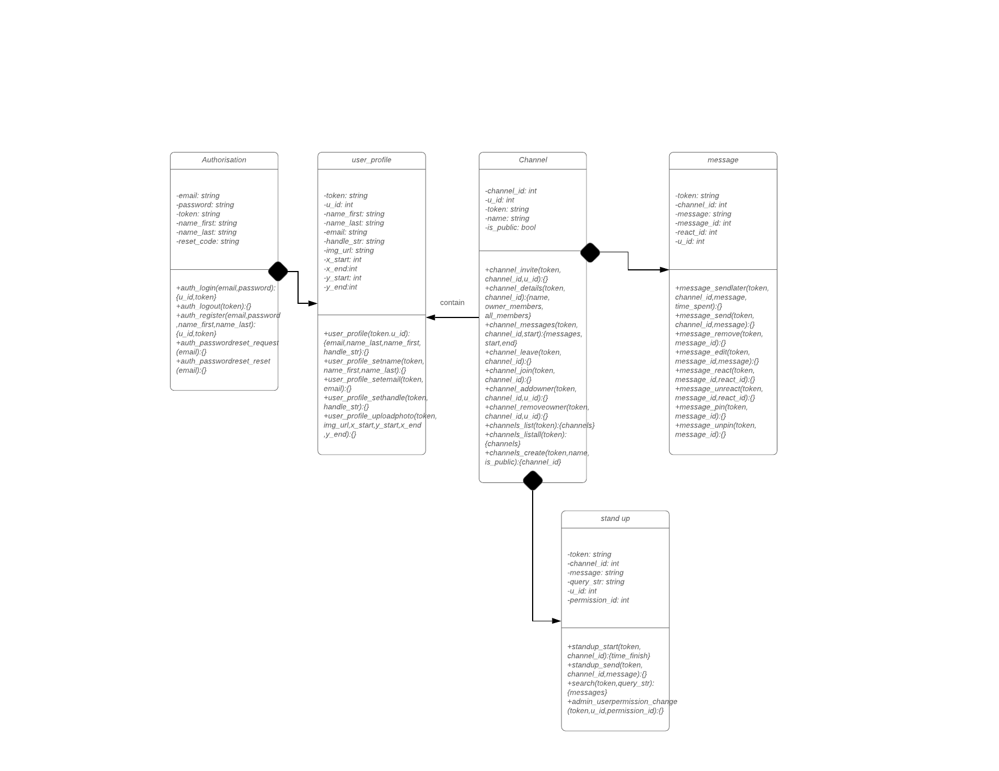

## Diagram
 
 
 
## Justifications
* The first diagram is an ER diagram that was drawn by our group to show the relationship between each entities clearly. This gives us a basic idea of how the databases within the slackr works.
* The second diagram is a class diagram that was drawn by our group to show the relationship between each classes. This gives us an insight on how classes function together in the app.
* By drawing these 2 diagrams, it gives us a basic idea of our priorities in implementing functions and a more in-depth understanding of the project.

## Plan
* By looking at the specifications as a group in group meetings, we believe Python, Flask, SQL databases, HTML, CSS and javascript are going to be useful in next few iterations.
* We plan to do 2 group meetings per week, one is in person on Tuesday 6pm, which is after our lab, and another one is online on Sunday(actual time varies).
* As we are in group of 5 and there are 5 classes shown in our diagram, everyone should be responsible for one class.
* We will be using Discord/Messenger for our onling meetings.
* To get started on iteration 2, we are going to do authorisation and channel first as other classes depends on these two classes as seen on the class diagram.
* Our priorities for all of the functions are listed from high priority to low priority as follows: auth_register, auth_login, auth_logout, user_profile, user_profile_setname, user_profile_setemail, user_profile_sethandle, user_profile_uploadphoto, channels_create, channel_join, channel_invite, channel_leave, channel_addowner, channel_removeowner, channel_list, channel_listall, channel_messages, channel_details, message_send, message_edit, message_remove, message_react, message_pin, message_unreact, message_unpin, message_sendlater,standup_start,standup_send,search,admin_userpermission_change.
* The reason why we listed priorities in this order is because we need to have a user first, then the user should fill in all their details. Following that, we need a channel and the ability to send messages. Finally we also need to implement the ability to start a standup. 
* The main idea is to have a skeleton at first, make it work first at the minimum and then fill in with more details while also leaving the challenging functions till last to implement.

## Time line

|  Task   |       Scheduled date                |
|---------|-------------------------------------|
|Skeleton of the project|10pm Thursday 10th October  |
|Implement channel&authorisation             |10pm Thursday 17th October |
|Implement message,user_profile,standup               |4pm Sunday 20th October|
|Implement challenge functions               |4pm Friday 25th October|
|Finish backend of project and add documentations               |4pm Thursday 27th October|

## Work load

Every group member should be responsible of at least 5-6 hours of coding per week. If anyone in the team has personal issues, he should inform the group as soon as possible so we can discuss in the group and find a solution.
Every group member is also responsible for documentation and each group member should contribute at least 1 hour per week on writing this.
