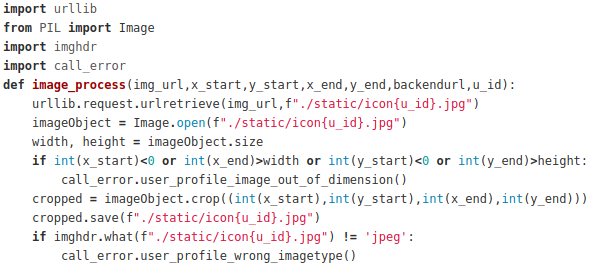
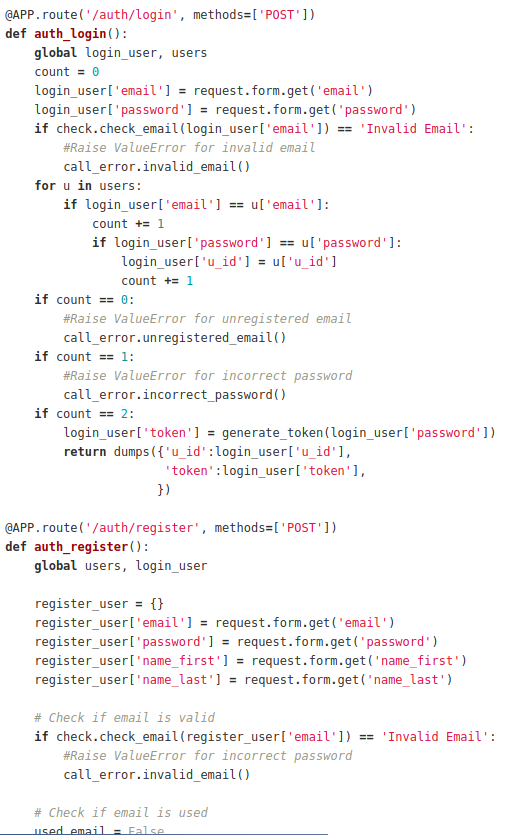
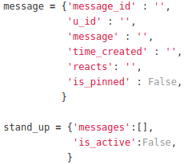
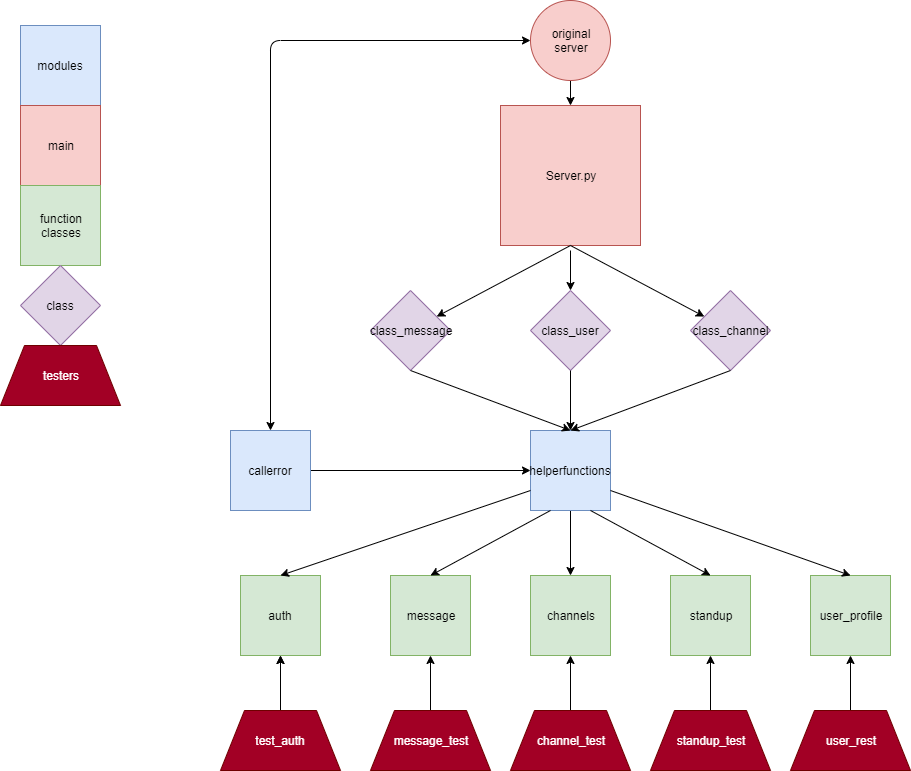

# Overview

* The focus on this iteration is to refactor our code. We found several design smells in our code. Thus we identified these smells, and applied SE principles, DRY and KISS method to refactor our code and make it more maintainable.

# Several design smells examples and how we modified them

## Rigidity

* For the img_url, we write f"/static/icon{u_id}.jpg" every time we tried to get the image path. But it's rather hard coding, like what if the image path changed? Then we need to find where the image path has been used in our program and change them. It's rather hard to change which means it's rigid. So what we did here is that we defined a variable called img_path at the top and used it as img_path. It makes our code more understandable, maintainable and reusable.

 

* Not many more things could be done to improve such a problem.

## Immobility

* For the previous work we did, we put all the functions into the server which makes it hard to reuse and move. So for this iteration, we split them into many files which contain its class, function and main server (which only contains flask things). It makes the code more understandable, maintainable and reusable.

* We also believe that this enables us to continue in the development of potential features much more efficiently as functions are now separated via role (e.g user_profile and channel associated functions). As a group, we realised the importance of code that is understandable and organised in a manner which is intuitive to the human and as such, we have catered to this need.

* However, we felt that due to the requirements for submission (certain files required in specified directory), improvements for mobility were limited and could have been improved a much more substantial amount with the use of separate directories and the like.

* We felt that the potential that could've have been fulfilled if the submission requirements did not specify the existence of certain files.

## Opacity

* Because we didn't add comments as we coded, the code became less clear. Also, because we didn't use classes in iteration1 and iteration2, it's also became a bit hard for the reader to understand. Therefore, we used classes in this iteration and added comments as we coded, which made our code more extensible, reusable, maintainable and understandable.

* This also helps with the classifications within our functions (classes). This way, we can appropriately and correctly categorise functions and methods within our backend and limit the efficiency of our work.

* In this iteration, improvements to opacity were relatively easy but tedious due to the sheer amount of changes needed within the files and code. A good portion if our code (lines) were purely comments and had no effect upon the function of the backend. 

## Needless complexity

* Sometimes there are already some built-in functions that we can use instead of us having to write a 100 of lines of code to implement a certain function which means needless complexity. Thus, we use as much built-in functions as possible to reduce the complexity. This also follows with the KISS (Keep it Simple, Stupid) principle.

* The use of built-in functions also indirectly resulted in the decrease of opacity due to the sheer amount of functions that were required. As such, we added comments to them to clarify their role.

* Complexity though, was not a problem prevalent within our code and the amount of changes purely made due to complexity were a smaller amount then when compared to the other examples. Most of our code did not rely on complex functions, but rather, relied on alot of repetitive logic (which was handled as described below) and did not require many direct changes to the logic. 

## Needless repetition

* Back in iteration2, we use some for loops a lot. So as a result, turned them into functions and call them to save lines of code. Therefore we put the most frequently used functions into a file that we called helperfunctions and called the functions from here when we need them. It makes the code reusable (we are reusing the functions again and again), maintainable (you just need to change the functions inside helperfunctions file instead of search where the function occurs and change them one by one), and understandable(instead of using for loop and add comments in it, make a function with a reasonable name make it more understandable for the reader). That also follows with the DRY (Don't repeat yourself) principle.

* However, much of this was done after the server was completed. We knew that any optimisation that was implemented prematurely would have rather tedious consequences (continuous revisions of the file). Thus, the bulk of our code remained quite repetitive until specific functions or logic were targeted as a potential node for revision into helperfunctions. This in consequence followed the guidelines outlined in DRY as it eliminated any possibility of reimplementing already existing functions (as we were doing it all at once).

* As noted, needless repetition was perhaps the most prevalent issue within our code that we sought to fix. Though with the creation of an entirely new module and its distribution throughout the server, its benefits in the reduction of pure code was substantial to say the least.

# Conclusion

* In conclusion, we have modified our code via discovering and modifying design smells, applying DRY, KISS method. Thus, we make sure that our code follows the SE principles (mostly through abstraction) which are extensible, reusable, maintainable, understandable and testable.

* As a rough estimate, our raw lines of code have been reduced by 40% from the lines in iteration 2 (2500 in iter2 to 1500 aproximately). This reduction in code combined with the implementation of a new helperfunction module, has resulted in what we believe, is a very efficient and well-structured code. 

* The structure of our code

* Throughout the entire development of this backend server, we have prioritised the importance of software engineering principles as we continually learned more during the progression of the course. For the progression of our skills and our own sanity, we stuck to these principles as they were taught to us. 

* Thus in this iteration, the complete implementation of SE principles has revealed the power of these ideas in streamlining our code. Furthermore, it has enabled us to elevate our code to a level and efficiency, never thought possible during the second iteration.